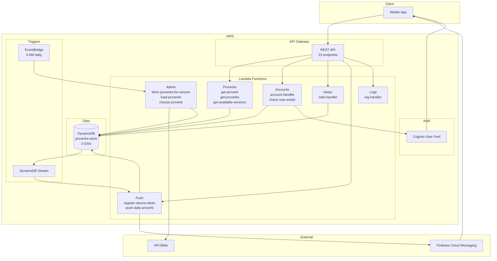
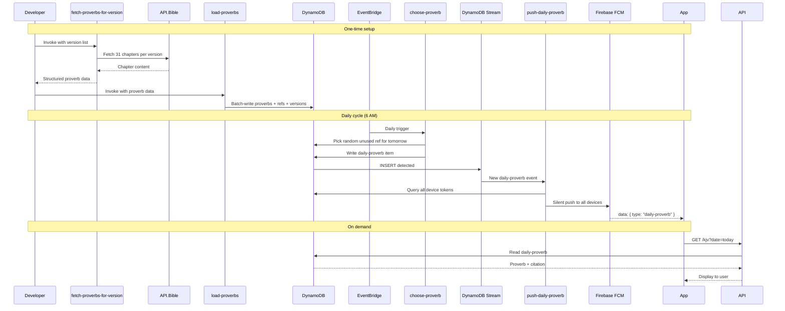
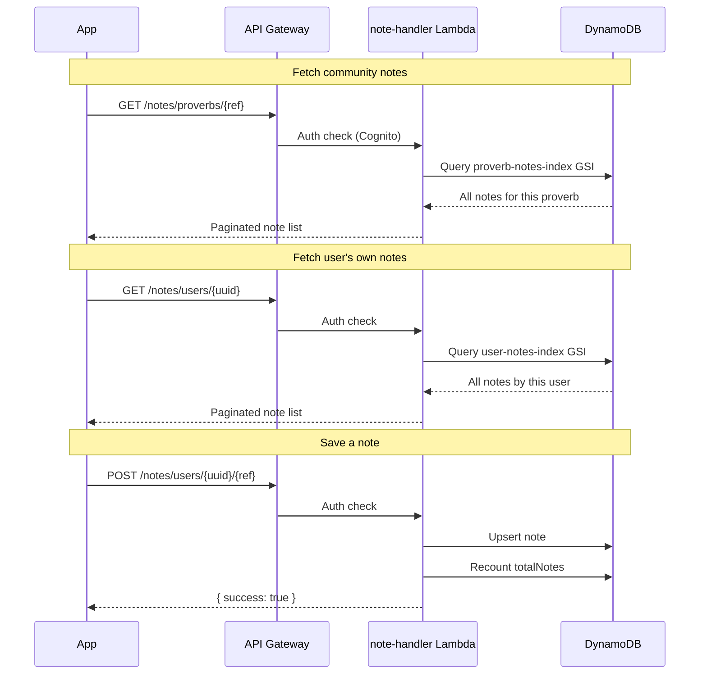

# Lemuel Backend

This is the backend for the [Lemuel](https://github.com/your-org/lemuel) daily proverb app. It's built with AWS CDK (TypeScript) and runs entirely on AWS serverless infrastructure.

## What it does

The backend handles everything the mobile app needs:

- **Proverbs** — Fetches proverbs from [API.Bible](https://api.bible/), stores them, and serves the daily proverb
- **User accounts** — Manages sign-up, sign-in, and user profiles via AWS Cognito
- **Notes** — Stores rich-text notes that users write about each proverb, and serves community notes
- **Meditations** — Tracks when users complete a meditation session
- **Push notifications** — Sends a silent push to everyone's phone when a new daily proverb is chosen (the app then schedules a local notification at the user's preferred time)
- **Multiple Bible versions** — Supports KJV, NIV, ESV, and more

## Architecture



### How the daily proverb gets served



### Notes flow



- **3 CDK stacks**: Secrets, User Management (Cognito), and Main (DynamoDB + Lambdas + API)
- **12 Lambda functions** — Each focused on a single responsibility
- **DynamoDB** with 3 global secondary indexes (version-index, proverb-notes-index, user-notes-index)
- **EventBridge** cron runs daily at 6 AM to pick the next proverb

## Development

```bash
# Install
pnpm install

# Type-check
pnpm typecheck

# Lint
pnpm lint

# Test
pnpm test

# Build
pnpm build

# Deploy (requires AWS credentials)
pnpm dep   # runs: cdk deploy --all --profile AdministratorAccess-640223110844
```

### Invoking Lambdas directly

```bash
# Load proverbs into DynamoDB (after fetching)
pnpm invoke:load

# Trigger proverb selection
pnpm invoke:choose

# Fetch proverbs from API.Bible
pnpm invoke:fetch-proverbs-for-version
```

## Tech stack

- **AWS CDK v2** — Infrastructure as code
- **TypeScript** + **tsup** — Lambda bundling
- **DynamoDB** — Primary database
- **API Gateway** — REST API
- **Cognito** — Authentication
- **Firebase Cloud Messaging** — Push notifications
- **EventBridge** — Cron scheduling
- **Secrets Manager** — API key storage
- **Zod** — Runtime validation
- **Jest** + **aws-sdk-client-mock** — Testing
